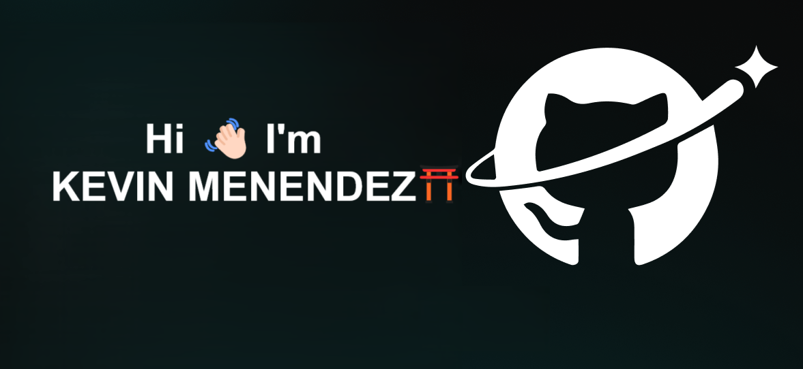
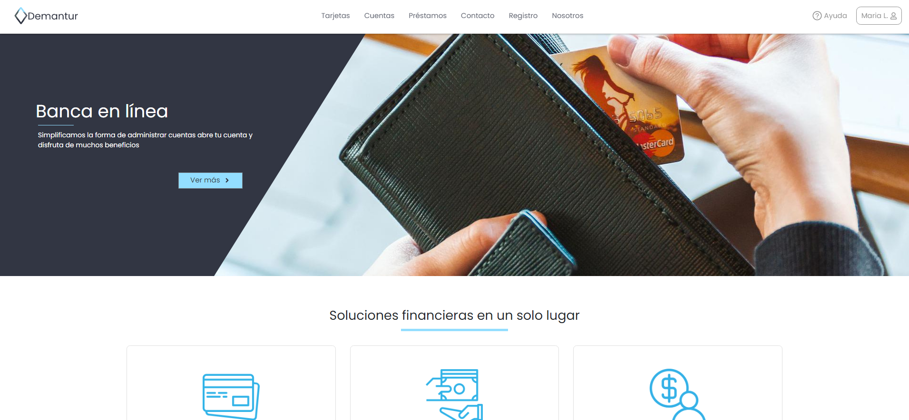

# 💻  Software Developer & Engineering Student

### Welcome to my GitHub profile!🐈‍⬛

Hi 👋🏻, I'm Kevin Menéndez. My career in software development began several years ago when I embarked on studying this field. During this time, I have gained experience in various areas, including programming languages, web development, database management, and object-relational mapping (ORM).

What excites and motivates me most about the technology field is its boundless potential for innovation and problem-solving. I find it deeply rewarding to tackle complex challenges and develop solutions that positively impact people's daily lives. Whether it's creating a web application to streamline business processes or contributing to open-source projects that enhance the global technology community, my goal is to continually expand my knowledge and make meaningful contributions to the field.

I firmly believe that continuous learning and collaboration are essential for driving progress in technology. These principles not only fuel my personal growth but also support the ongoing evolution of the software development industry.

## Projects 🏦
#### Here are some of the projects I've been working on:

1. **DEMANTUR** 💵
 DEMANTUR is a financial web application designed to simplify banking processes in daily life. Our goal is to deliver a modern, reliable, and high-quality service, equipped with essential tools that ensure a user-friendly and dynamic experience.  
 In addition to promoting financial inclusion, DEMANTUR fosters sustainability by creating an educational environment for those seeking guidance on banking processes. Through this approach, we aim to empower users with the knowledge and resources they need to navigate the financial world confidently.

 <a href="https://github.com/Menendez2004/Demantur" target="blank">GitHub Repository</a>

## Education 📖
- **Software Development Engineer**
- Currently pursuing a Bachelor's degree in Software Development Engineering at Universidad Don Bosco (UDB)
-  graduation in 2025.
- Highly committed to mastering the foundational principles of software development, demonstrating a strong dedication to academic and professional growth in the field.

## Tech stack  🖥️

<table border="0" cellspacing="5" cellpadding="10" width="400" height="100" align="center">
  <tr>
    <th><b>Programming Languages</b></th>
    <th><b>Front End Development</b></th>
    <th><b>Back End Development</b></th>
    <th><b>Database</b></th>
  </tr>
  <tr>
    <td align="center"></td>
    <td align="center"></td>
    <td align="center"></td>
    <td align="center"></td>
  </tr>

</table>

## My lenguages &nbsp;  

  

## &nbsp;Connect with me &nbsp;  

 

